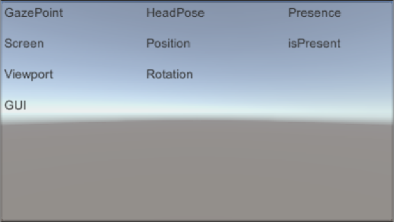

# Download

Para fazer o download da SDK para Unity que a Tobii fornece, primeiro vá a area
de desenvolvedor no site da empresa e crie um usuário. Feito isso procure a
sessão de downloads e procure pela UnitySDK. Você será redirecionado à uma
pagina de downloads do GitHub, selecione o **.unitypackage** 


\pagebreak

# Importando para o projeto

Após fazer o download precisamos carregar o SDK para nosso projeto, clique com o
botão direito na sua pasta assets, e selecione **Import Package > Custom
Package...**.


Procure o pacote que você acabou de baixar e o selecione, ao clicar em abrir,
ele começará a ser expandido, aguarde.


\pagebreak

Assim que o pacote terminar de expandir um pop-up se abrirá para que se
selecione os recursos que se quer importar. Além do necessário, o pacote que a
Tobii fornece, tem também algumas cenas demo para que se possar ter uma ideia
do que é possível fazer com a SDK. Incentivamos que observem as cenas
demonstrativas em outro momento.

<div class="alert">
Em nossas aulas não utilizaremos o plugin GazeAware
</div>


Após importado um outro pop-up aparecerá, para concordar com os termos de
serviço da Tobii Eye Tracker SDK for Unity3D. Feito isso a SDK está pronto para
ser usado!

# Primeiro projeto com Eye Tracking

Agora que já podemos usar a SDK, vamos fazer o primeiro projeto que irá
consumir os dados que nos fornece. 

Para isso incie um novo projeto, e na cena acrescente um Canvas, para podermos
montar a UI que utilizaremos, assim que adicionar o canvas um Event será
adicionado também, mantenha-o no projeto. 

Adicione agora um Panel ao canvas, e ao panel, alguns elementos Text, a cena
deverá ficar como abaixo:


\pagebreak

Feito isso agora organize os **Text** no **Panel** para que todos possam ser
lidos.



Finalizada essa etapa vamos inserir um novo script ao Canvas que criamos.
Clique em **Add Component > New Script**, dê um nome para seu script e clique
em **Create and Add**


Feito isso, a Unity irá criar seu script na raiz da pasta Assets, para manter o
projeto organizado crie uma nova pasta "Scripts" e coloque seu arquivo nela.

Podemos abrir o arquivo para editá-lo agora. Podemos deixa-lo vazio, apenas
como abaixo:

```csharp
using UnityEngine;
public class TobiiDataOnGUI : MonoBehaviour
{

}
```

Crie agora propriedades públicas na sua classe para que possa altear os textos
que criamos na GUI com maior facilidade. Precisamos adicionar a diretiva `usign
UnityEngine.UI`

```csharp
using UnityEngine;
using UnityEngine.UI;
public class TobiiDataOnGUI : MonoBehaviour
{
        public Text txGazeScreen;
        public Text txGazeViewport;
        public Text txGazeGUI;
        public Text txHeadPosition;
        public Text txHeadRotation;
        public Text txPresence;
}
```

Lembrando que toda vez que definimos uma propriedade como `public` em um script
na Unity ela irá aparecer no inspetor para que possamos defini-la pela
interface. Assim, salve seu script, e configure os textos respectivos.


Feito isso, vamos adicionar a integração do Eye Tracker inserindo `using
Tobii.Gaming`. Nesse primeiro momento vamos capturar o ponto em que o usuário
está olhando, utilizamos o `TobiiAPI.GetGazePoint()` que irá retornar um objeto
`GazePoint` com os dados capturados em diferentes espaços: Screen, Viewport e
UI.

```csharp
...
using Tobii.Gaming
...
public class TobiiDataOnGUI : MonoBehaviour
{
...

	void Update()
	{
		GazePoint gazePoint = TobiiAPI.GetGazePoint();
	}
...
```

O `GazePoint` que acabamos de capturar, como já dito, tem várias informações,
vamos ver onde, da tela, que nosso usuário está olhando e atualizar nossa UI
com essa informação.


```csharp 
...
GazePoint gazePoint = TobiiAPI.GetGazePoint();
Vector2 screenPoint = gazePoint.Screen;
txGazeScreen.text = "Screen: " + screenPoint;
...
```


