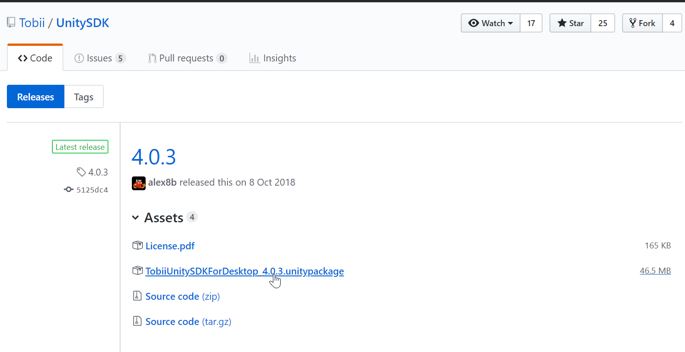

# Download

Para fazer o download da SDK para Unity que a Tobii fornece, primeiro vá a area
de desenvolvedor no site da empresa e crie um usuário. Feito isso procure a
sessão de downloads e procure pela UnitySDK. Você será redirecionado à uma
pagina de downloads do GitHub, selecione o **.unitypackage** 

# Importando para o projeto

Após fazer o download precisamos carregar o SDK para nosso projeto, clique com o
botão direito na sua pasta assets, e selecione **Import Package > Custom
Package...**.

Procure o pacote que você acabou de baixar e o selecione, ao clicar em abrir,
ele começará a ser expandido, aguarde.

Assim que o pacote terminar de expandir um pop-up se abrirá para que se
selecione os recursos que se quer importar. Além do necessário, o pacote que a
Tobii fornece, tem também algumas cenas demo para que se possar ter uma ideia
do que é possível fazer com a SDK. Incentivamos que observem as cenas
demonstrativas em outro momento.

Em nossas aulas não utilizaremos o plugin GazeAware

Após importado um outro pop-up aparecerá, para concordar com os termos de
serviço da Tobii Eye Tracker SDK for Unity3D. Feito isso a SDK está pronto para
ser usado!

# Primeiro projeto com Eye Tracking

Agora que já podemos usar a SDK, vamos fazer o primeiro projeto que irá
consumir os dados que nos fornece. 

Para isso incie um novo projeto, e na cena acrescente um Canvas, para podermos
montar a UI que utilizaremos, assim que adicionar o canvas um Event será
adicionado também, mantenha-o no projeto. 

Adicione agora um Panel ao canvas, e ao panel, alguns elementos Text, a cena
deverá ficar como abaixo:

